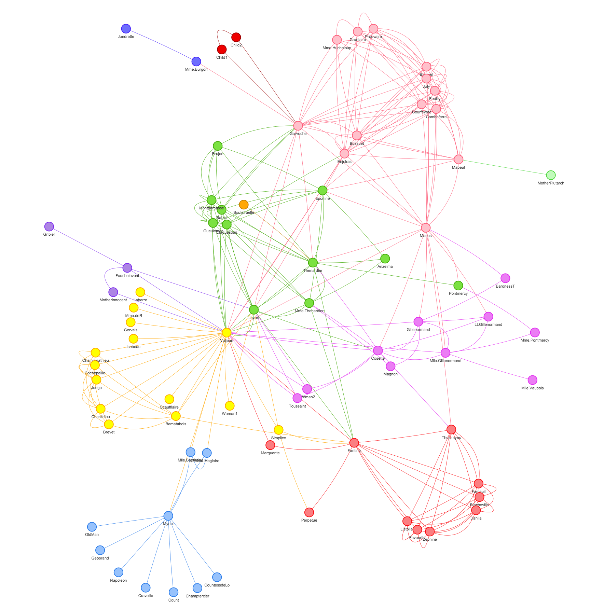

# React graph vis

A React component to display beautiful network graphs using vis.js

Show, don't tell: [Demo](http://crubier.github.io/react-graph-vis/)

Make sure to visit [visjs.org](http://visjs.org) for more info.

Rendered graphs are scrollable, zoomable, retina ready, dynamic, and switch layout on double click.



Due to the imperative nature of vis.js, updating graph properties causes complete redraw of graph and completely porting it to React is a big project itself!

This component takes three vis.js configuration objects as properties:  

- graph: contains two arrays { edges, nodes }
- options: normal vis.js options as described [here](http://visjs.org/docs/network/#options)
- events: an object that has [event name](http://visjs.org/docs/network/#Events) as keys and their callback as values

# Usage

```javascript
var Graph = require('react-graph-vis');

var graph = {
  nodes: [
      {id: 1, label: 'Node 1'},
      {id: 2, label: 'Node 2'},
      {id: 3, label: 'Node 3'},
      {id: 4, label: 'Node 4'},
      {id: 5, label: 'Node 5'}
    ],
  edges: [
      {from: 1, to: 2},
      {from: 1, to: 3},
      {from: 2, to: 4},
      {from: 2, to: 5}
    ]
};

var options = {
    layout: {
        hierarchical: true
    },
    edges: {
        color: "#000000"
    }
};

var events = {
    select: function(event) {
        var { nodes, edges } = event;
    }
}

React.render(<Graph graph={graph} options={options} events={events} />, document.body);
```

You can also check out the demo in the [`example`](https://github.com/crubier/react-graph-vis/tree/master/example) folder.
